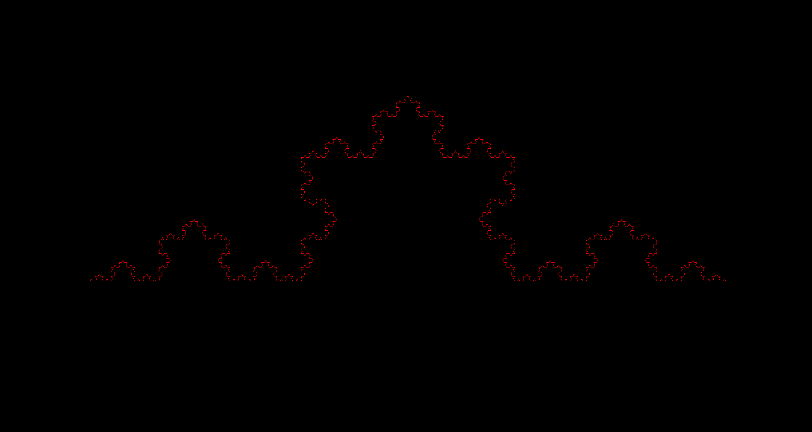
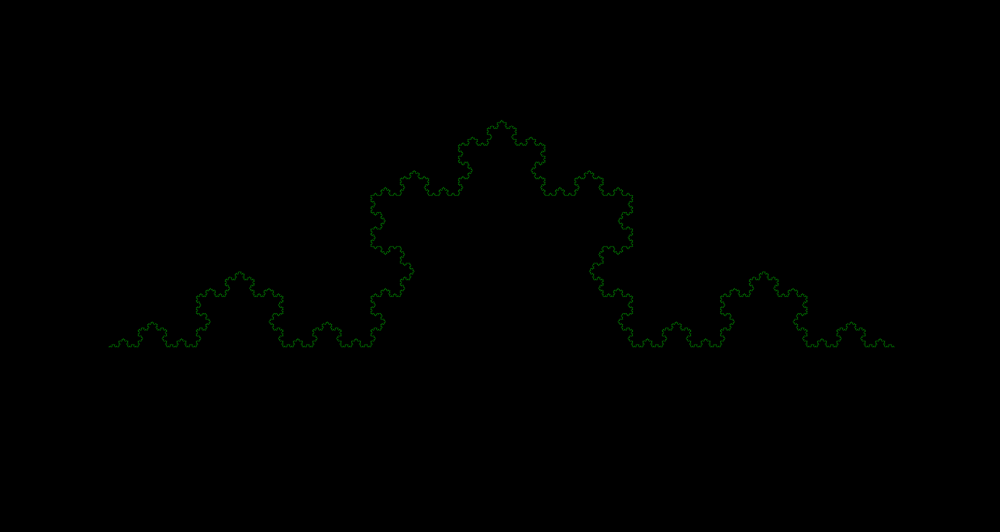
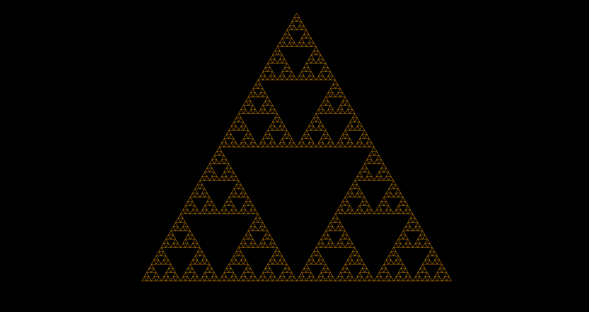
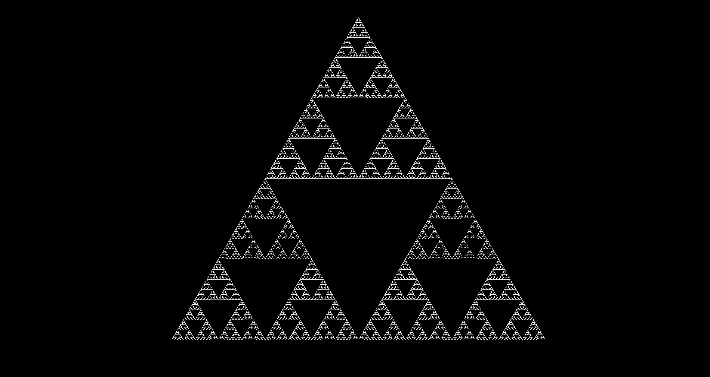

# fractals

This repo contains some code that I made exploring fractals.
Note that the *bitmap_image.hpp* file is an open source file that I did not write.

Here are some cool fractals that I made using various methods.

**Tetration**

**Mandelbrot**

**Newton**

**Koch**

**Sierpinski**

