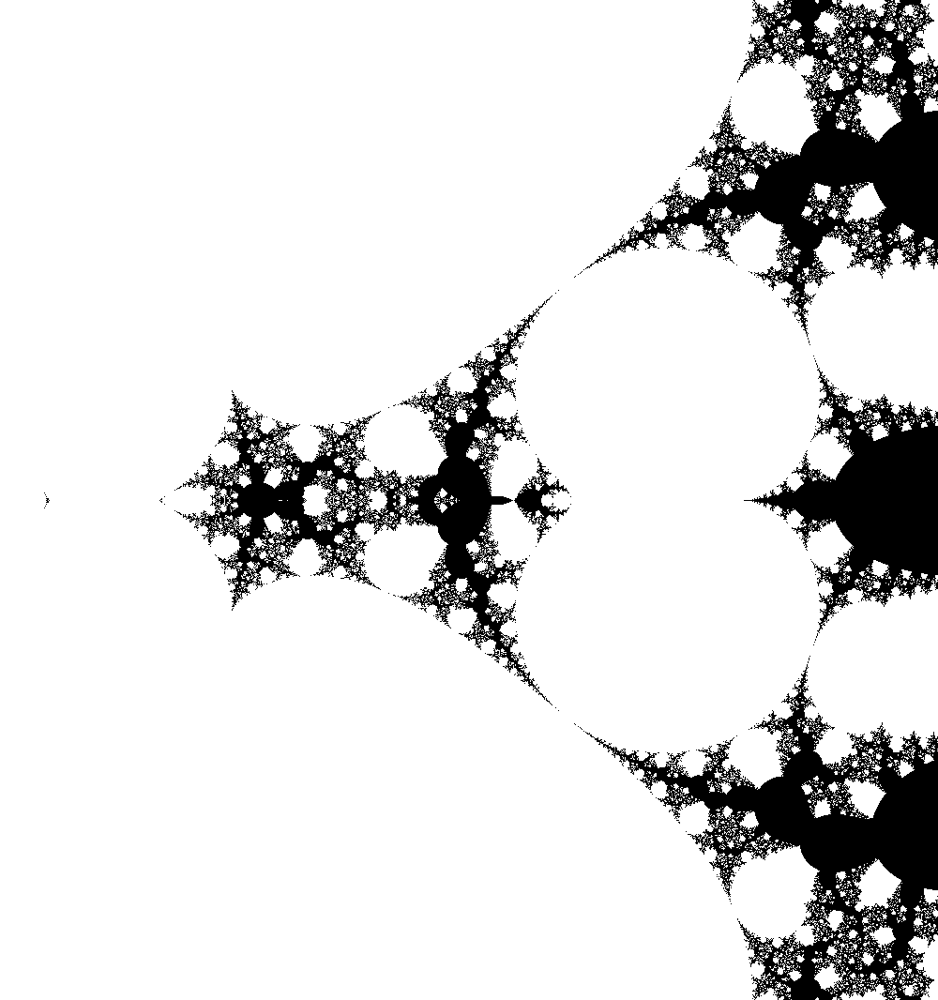

# fractals

This repo contains some code that I made exploring fractals.
Note that the *bitmap_image.hpp* file is an open source file that I did not write.

Here are some cool fractals that I made.

| **mandelbrot set**                                                               | **tetration**                                                              |
|----------------------------------------------------------------------------------|----------------------------------------------------------------------------|
|  |  |
|    |  |

