# fractals

This repo contains some code that I made exploring fractals.

Here are some cool fractals that I made using various methods.

 * `fractalgen` generates fractals using various methods of coloring the complex plane
 * `mandelview` renders the mandelbrot set on the GPU with realtime controls for exploration
 * `code/python/points/` contains python scripts that generate fractals using points
 * `code/python/lines/` uses the turtles library combined with recursion to make some fractals

## Attribution

* Open source dependencies: CMake, CLI11, stb, GLFW, glad, glm, stf
* `code/deps/csci441` contains code from a course that I took on graphics taught by Dr. David Millman at Montana State University

## Images

**Tetration**

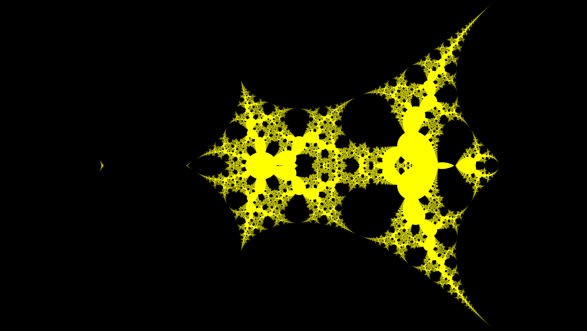
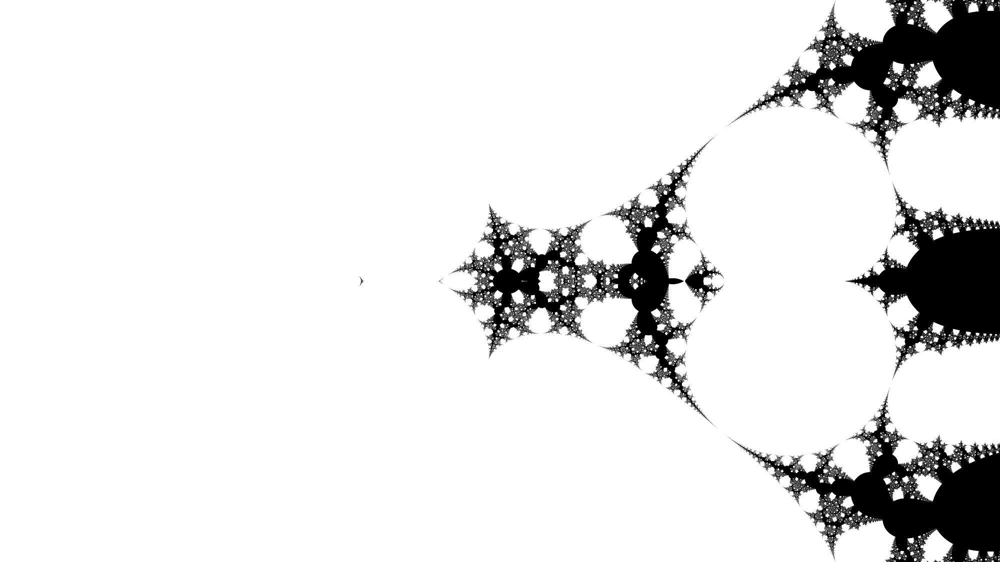

**Mandelbrot**

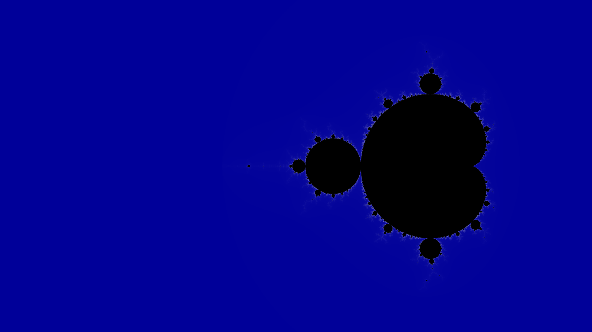
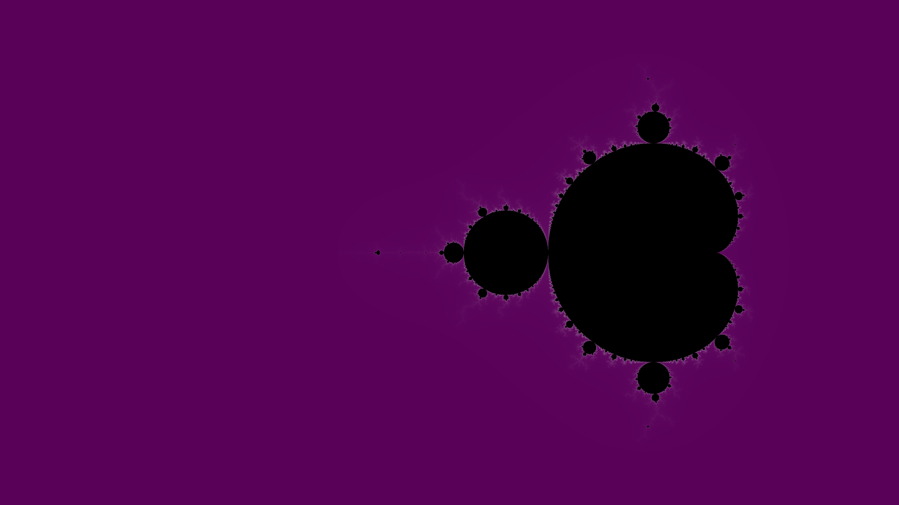
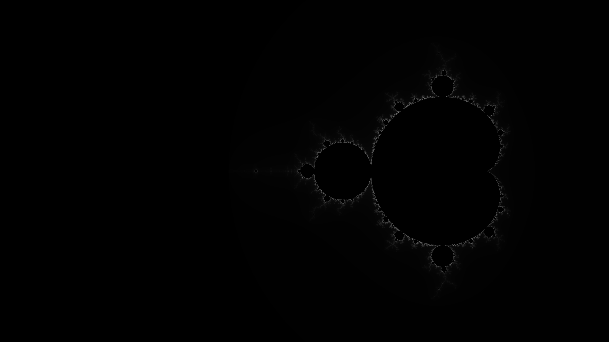

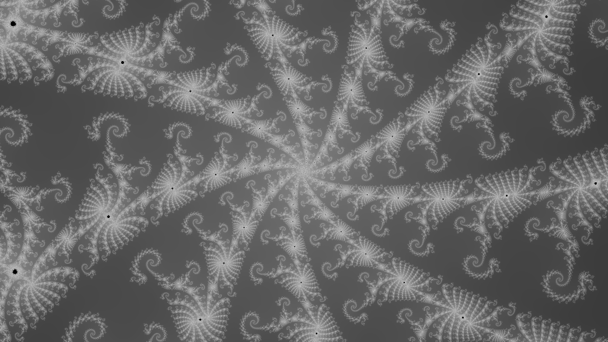
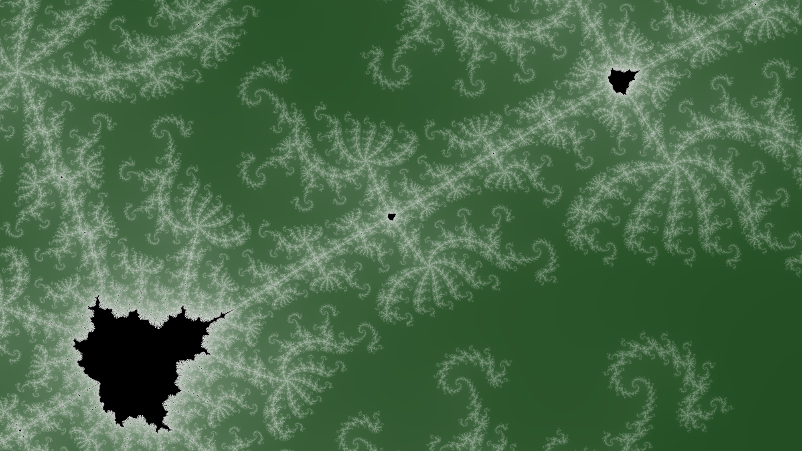
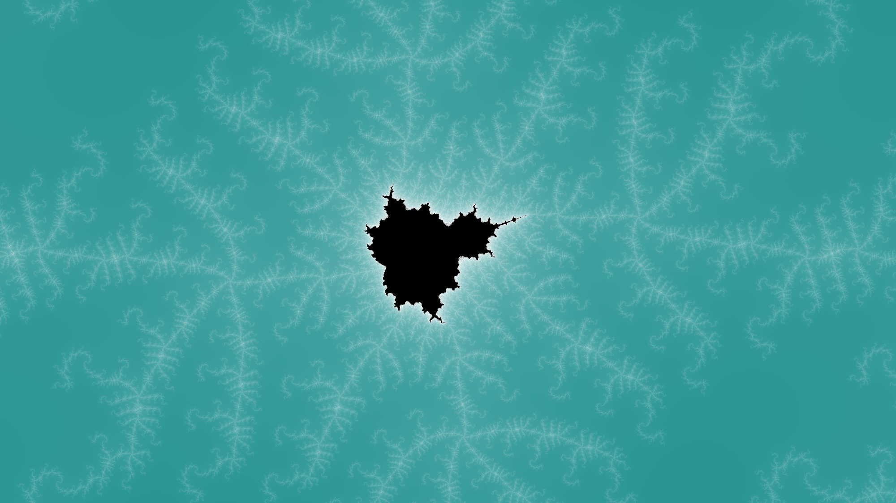

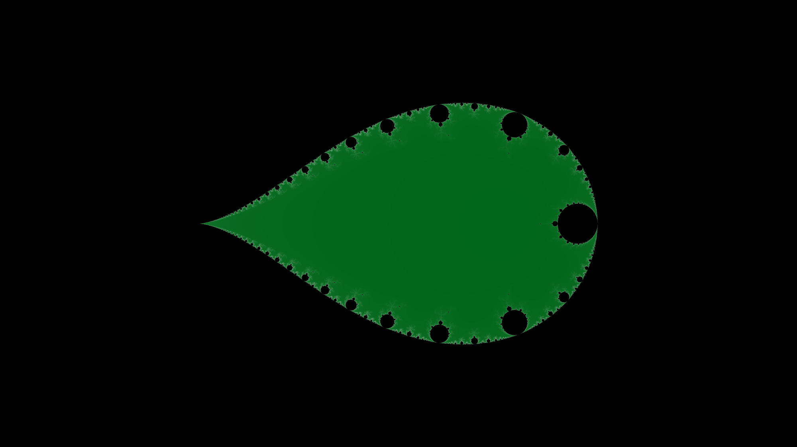

**Newton**

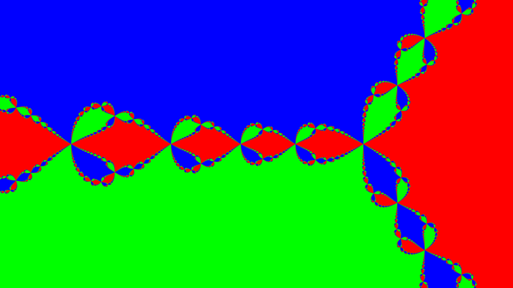
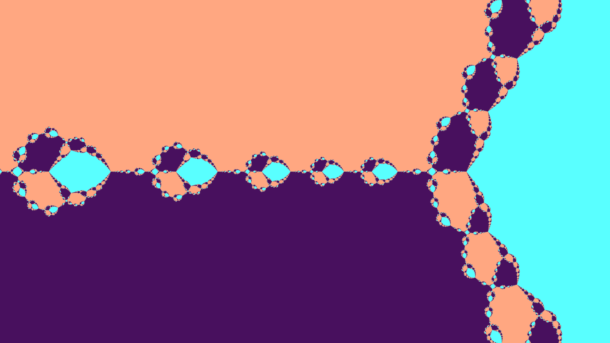
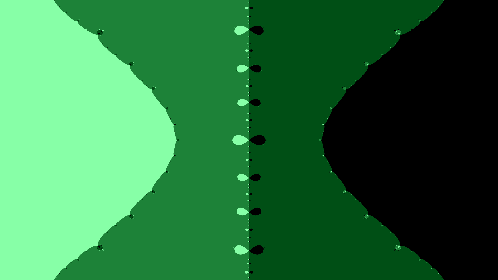
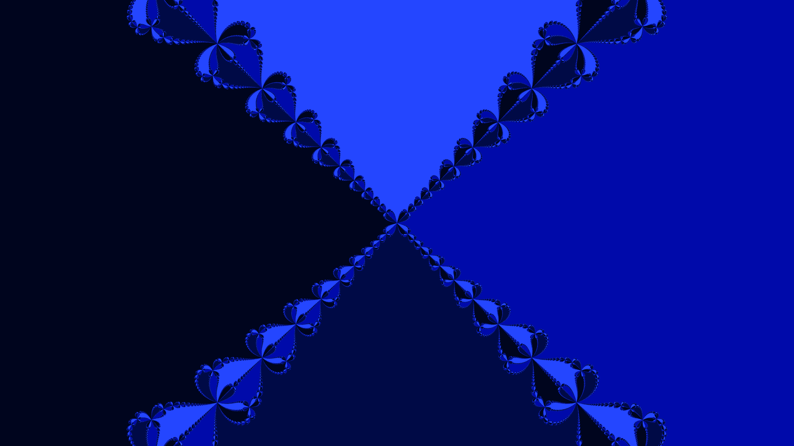

**Koch**

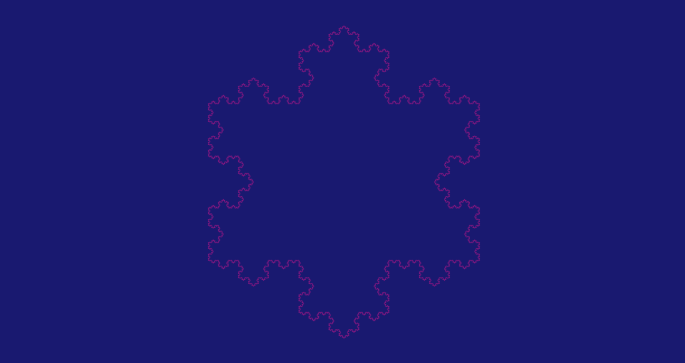

**Sierpinski**

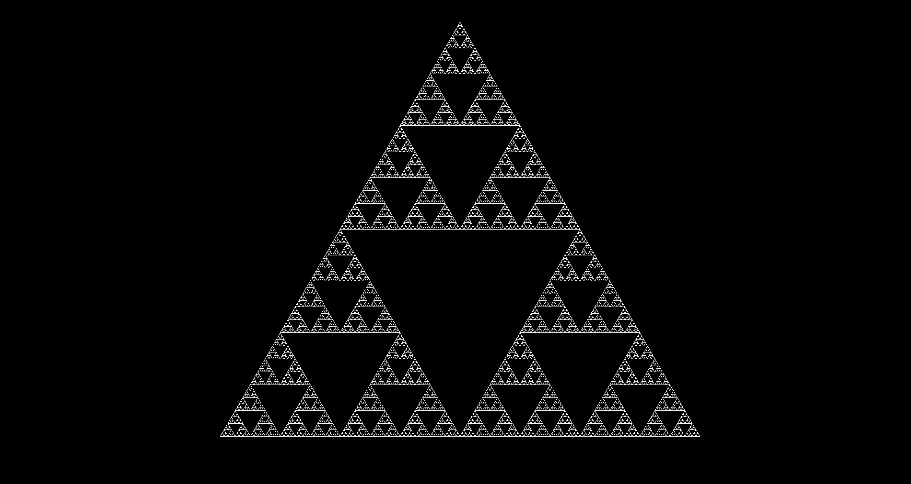

